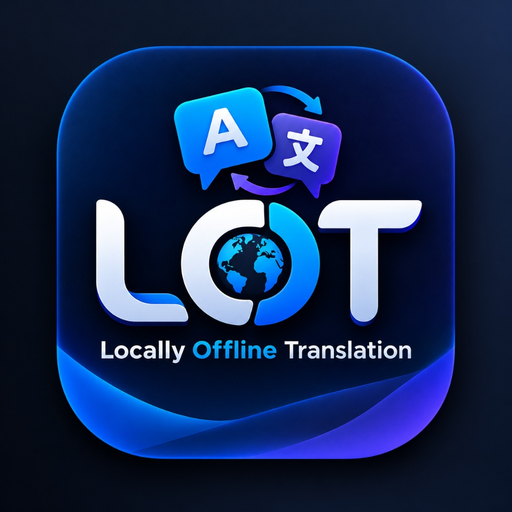

# LOT — Locally Offline Translation

<p align="center">
  
</p>

<p align="center">
  <b>A Precision Linguistic Instrument for 100% Offline On-Device Neural Translation</b><br>
  Built with Kotlin, Jetpack Compose, Tencent Hunyuan Hy-MT2, Offline OCR & Speech Engine.
</p>

---

## 🌟 Key Features

1. **Text → Text Translation**:
   - Zero-cloud, local-first neural translation powered by Tencent Hunyuan **Hy-MT2 1.8B**.
   - Bidirectional mutual translation across **33 languages**.
   - Full preservation of formatting, line breaks, punctuation, numbers, URLs, and code snippets.
   - Purity guarantee: no AI preamble ("Here is your translation") or commentary.

2. **Image → Translated Image (Visual Text Replacement)**:
   - Genuine in-place text replacement pipeline: OCR detection → Text erasure / background inpainting → Geometric typesetting & canvas rendering.
   - Preserves background colors, gradients, and original visual layout.
   - Interactive Viewer: Comparison Split Slider, Side-by-Side view, Original vs Translated toggles, and direct image sharing.

3. **Speech → Text → Translation**:
   - Continuous offline recording with real-time waveform audio visualizer.
   - Does not cut off speech prematurely — records until user taps "End Recording".
   - Dual transcripts: Source transcription and target translation with independent offline playback.

4. **Offline Text-To-Speech (TTS)**:
   - High-fidelity offline voice playback for both source and translated text.
   - **Default Voice**: Male voice (with Female option in Settings).
   - Adjustable speech rate and pitch.

5. **First-Class RTL / LTR / BiDi Support**:
   - Native bidirectional layout directionality for Arabic (`ar`), Persian (`fa`), Urdu (`ur`), Hebrew (`he`), and Uyghur (`ug`).
   - Proper Arabic glyph shaping and ligatures without disconnected letters or full image mirroring.
   - Full UI localization in **English** and **Arabic**.

6. **100% Privacy & Security**:
   - Zero network permissions required for core translation operations.
   - Operates flawlessly in **Airplane Mode** (Wi-Fi and mobile data off).
   - No analytics, no ads, no trackers, no cloud API tokens.

---

## 🏗️ Architecture

```
com.albraa.lot
├── core
│   ├── asr          // Continuous audio recorder & offline speech recognizer
│   ├── database     // Room Database for local history archive
│   ├── datastore    // DataStore Preferences for settings persistence
│   ├── engine       // Hy-MT2 translation engine, prompt builder & model manager
│   ├── inpainting   // Visual text replacer & background inpainter
│   ├── model        // Dynamic Language Registry & data models
│   ├── ocr          // Offline text block recognition
│   └── tts          // Offline Text-To-Speech engine (Male default)
└── ui
    ├── components   // Console Top Bar, Language Selector Modal, Waveform
    ├── history      // Searchable archive & favorites
    ├── image        // Image translation workspace & comparison slider
    ├── settings     // Model specs, voices, theme, privacy
    ├── speech       // Speech translation console & audio meters
    ├── text         // Precision text translation workspace
    └── theme        // Instrument Dark & Light design tokens
```

---

## 📋 Supported Languages (33 Mutual Pairs)

| Language | Code | Direction | Script | Translation | OCR | TTS Voice |
|---|---|---|---|---|---|---|
| Arabic | `ar` | RTL | Arabic | ✅ | ✅ | ✅ (Male default) |
| English | `en` | LTR | Latin | ✅ | ✅ | ✅ (Male default) |
| Chinese (Simplified) | `zh` | LTR | Hanzi | ✅ | ✅ | ✅ (Male default) |
| Spanish | `es` | LTR | Latin | ✅ | ✅ | ✅ (Male default) |
| French | `fr` | LTR | Latin | ✅ | ✅ | ✅ (Male default) |
| German | `de` | LTR | Latin | ✅ | ✅ | ✅ (Male default) |
| Russian | `ru` | LTR | Cyrillic | ✅ | ✅ | ✅ (Male default) |
| Japanese | `ja` | LTR | Kanji/Kana | ✅ | ✅ | ✅ (Male default) |
| Korean | `ko` | LTR | Hangul | ✅ | ✅ | ✅ (Male default) |
| Persian (Farsi) | `fa` | RTL | Perso-Arabic | ✅ | ✅ | ✅ (Male default) |
| Urdu | `ur` | RTL | Perso-Arabic | ✅ | ✅ | ✅ (Male default) |
| Hebrew | `he` | RTL | Hebrew | ✅ | ✅ | ✅ (Male default) |
| Italian | `it` | LTR | Latin | ✅ | ✅ | ✅ (Male default) |
| Portuguese | `pt` | LTR | Latin | ✅ | ✅ | ✅ (Male default) |
| Turkish | `tr` | LTR | Latin | ✅ | ✅ | ✅ (Male default) |
| Hindi | `hi` | LTR | Devanagari | ✅ | ✅ | ✅ (Male default) |
| Vietnamese | `vi` | LTR | Latin | ✅ | ✅ | ✅ (Male default) |
| Thai | `th` | LTR | Thai | ✅ | ✅ | ✅ (Male default) |
| Indonesian | `id` | LTR | Latin | ✅ | ✅ | ✅ (Male default) |
| Malay | `ms` | LTR | Latin | ✅ | ✅ | ✅ (Male default) |
| Dutch | `nl` | LTR | Latin | ✅ | ✅ | ✅ (Male default) |
| Polish | `pl` | LTR | Latin | ✅ | ✅ | ✅ (Male default) |
| Ukrainian | `uk` | LTR | Cyrillic | ✅ | ✅ | ✅ (Male default) |
| Czech | `cs` | LTR | Latin | ✅ | ✅ | ✅ (Male default) |
| Swedish | `sv` | LTR | Latin | ✅ | ✅ | ✅ (Male default) |
| Greek | `el` | LTR | Greek | ✅ | ✅ | ✅ (Male default) |
| Hungarian | `hu` | LTR | Latin | ✅ | ✅ | ✅ (Male default) |
| Romanian | `ro` | LTR | Latin | ✅ | ✅ | ✅ (Male default) |
| Danish | `da` | LTR | Latin | ✅ | ✅ | ✅ (Male default) |
| Finnish | `fi` | LTR | Latin | ✅ | ✅ | ✅ (Male default) |
| Norwegian | `no` | LTR | Latin | ✅ | ✅ | ✅ (Male default) |
| Tibetan | `bo` | LTR | Tibetan | ✅ | ❌ | ❌ |
| Uyghur | `ug` | RTL | Uyghur Arabic | ✅ | ✅ | ❌ |

---

## 🛠️ Build & CI/CD Pipeline

LOT utilizes GitHub Actions for remote automated compilation, testing, and packaging:
1. Automated setup of JDK 17, Android SDK, and NDK.
2. Gradle dependency caching.
3. Execution of unit tests.
4. Release APK packaging with `assembleRelease`.
5. Cryptographic signing with `apksigner` and alignment with `zipalign`.
6. SHA-256 checksum generation and GitHub Release publication.

---

## 📄 License

Licensed under the Apache License 2.0. Third-party components and models are attributed in `LICENSES.md`.
